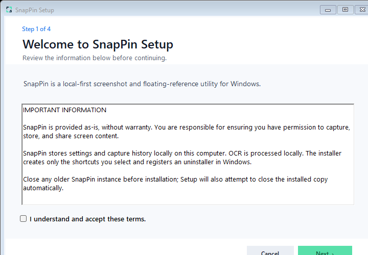
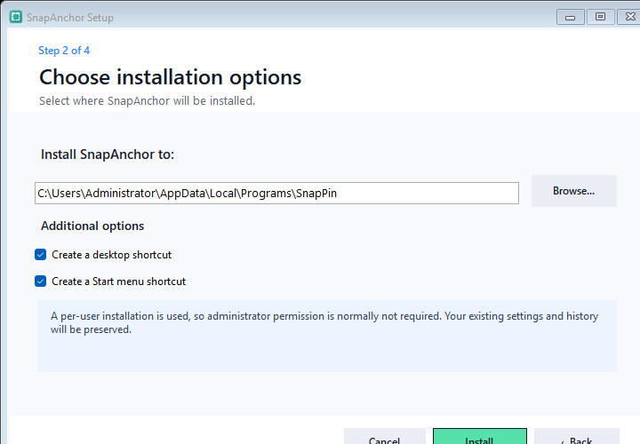
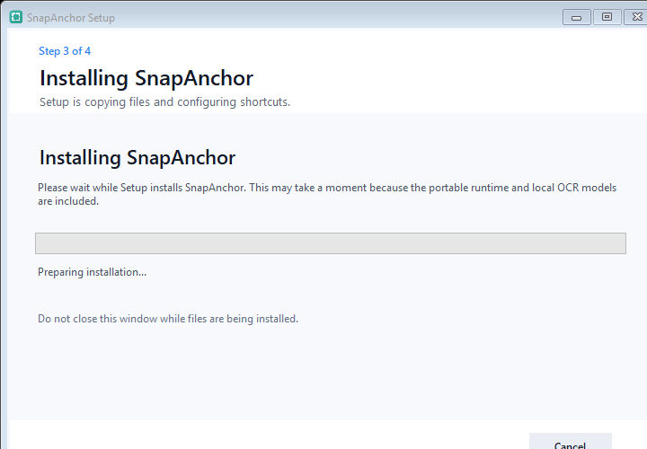
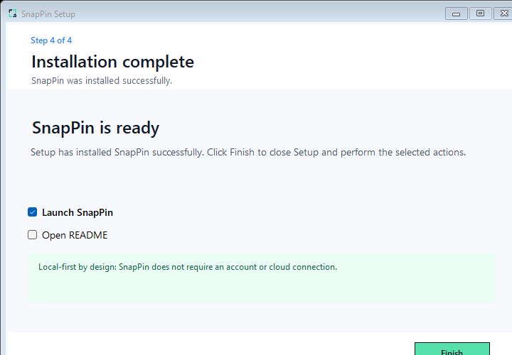

<p align="center">
  
</p>

<h1 align="center">SnapAnchor</h1>

<p align="center">
  <strong>Capture it. Keep it in sight.</strong><br>
  A fast, local-first screenshot, annotation, OCR, pinning, and recording tool for Windows.
</p>

<p align="center">
  
  
  
  
  
</p>

SnapAnchor keeps the whole capture workflow close to the screen: select a region, annotate it in place, copy or save it, pin it above other windows, extract text locally, or record the selected area. No account is required and recognition runs on the computer.

> [!IMPORTANT]
> SnapAnchor is an independent project. It does not contain Snipaste code, branding, icons, assets, or reverse-engineered internals, and it is not affiliated with or endorsed by Snipaste.

## Highlights

| Capture | Annotate | Pin and organize | Recognize and record |
|---|---|---|---|
| Region, window, UI element, active window, full screen, delayed, fixed-size, and scrolling capture | Shapes, arrows, lines, pencil, marker, text, blur brush, eraser, magnifier, undo/redo, and editable objects | Always-on-top pins, groups, multi-select, click-through, opacity, zoom, transforms, titles, shade, locking, and session restore | Offline OCR, selectable text inside pins, QR/barcode reading, MP4/GIF recording, pause/resume, review, trim, keep, or discard |

Other useful capabilities include:

- Configurable global hotkeys and per-application hotkey exclusions
- Physical-pixel, mixed-DPI multi-monitor capture
- Searchable local history with favourites, tags, recycle bin, and repeat-last-region
- PNG, JPEG, and WebP export, quick save, auto-save, printing, and copy-as-file
- English, Simplified Chinese, and Traditional Chinese interfaces
- Configurable capture and annotation toolbars in Compact, Standard, or Large sizes
- Privacy exclusions for SnapAnchor and selected applications during captures and recordings
- Crash recovery, atomic settings, pin-session backup, update verification, and installer rollback
- Command-line actions for capture, recording, pinning, drawing, history, settings, and whiteboards

## Download and install

Use the [latest GitHub release](https://github.com/coolman1232004/SnapAnchor/releases/latest) for ready-to-run builds. Do not download the automatically generated source-code archive unless you intend to compile SnapAnchor yourself.

### Windows installer

1. Download `SnapAnchor-Setup-win-x64.exe` from the latest release.
2. Open it and follow the setup wizard.
3. Choose the install location and optional Desktop/Start Menu shortcuts.
4. Leave **Launch SnapAnchor** selected on the final page if you want to start immediately.

The installer places SnapAnchor under `%LOCALAPPDATA%\Programs\SnapAnchor` by default and registers a normal Windows uninstaller.

<details>
<summary>View the four installer steps</summary>

| Welcome and terms | Install location and shortcuts |
|---|---|
|  |  |

| Installation progress | Finish and launch |
|---|---|
|  |  |

</details>

### Portable version

1. Download `SnapAnchor-Portable-win-x64.zip` from the latest release.
2. Extract the entire ZIP to a writable folder.
3. Open the extracted folder and run `SnapAnchor.exe`.

The package is self-contained; a separate .NET installation is not required. Portable copies update in place from official GitHub releases: SnapAnchor verifies the ZIP, retains a rollback backup, replaces the program files after closing, and restarts automatically. No installer or manual re-extraction is required.

### Upgrading from version 1.x

Version 2.0 renames the application to **SnapAnchor**. On first launch, it automatically imports existing local settings, capture history, pinned sessions, diagnostics, and startup registration. The 2.0 portable ZIP includes a hidden, one-release compatibility launcher so an existing 1.x portable copy can update in place; it is removed after the transition. The installer upgrades the previous per-user installation and removes obsolete product files and shortcuts after a successful copy.

The original application data is left intact as an additional fallback. The exact pre-rename source is also preserved by the `pre-snapanchor-v1.2.15` Git tag.

> [!NOTE]
> Current packages are not code-signed. Windows SmartScreen may therefore show an “Unknown publisher” warning. Verify that the file came from this repository's release page and compare its SHA-256 value with `release.json` before running it.

Verify a download in PowerShell:

```powershell
Get-FileHash .\SnapAnchor-Setup-win-x64.exe -Algorithm SHA256
```

## Quick start

| Action | Default shortcut |
|---|---:|
| Capture a region | `Print Screen` |
| Pin clipboard content | `F3` |
| Restore interaction with click-through pins | `Alt` + `Shift` + `P` |
| Full-screen drawing | `Ctrl` + `Shift` + `D` |
| Record a selected region | `Ctrl` + `Shift` + `R` |

After starting a capture:

1. Drag to select an area, or point at a detected window/UI element.
2. Resize with the eight handles if necessary.
3. Choose an annotation tool directly from the toolbar, or select Copy, Pin, Save, OCR, Record, or Recapture.
4. The capture is completed only when you choose an output action.

Pinned images support mouse-wheel resizing, `Ctrl` + wheel opacity, right-click tools, and double-click close. Preferences can change the hotkeys, toolbar layout, output folders, OCR defaults, pin behaviour, recording options, and capture hints.

## Privacy

SnapAnchor is designed to work locally:

- Screenshots, history, pin sessions, OCR text, and recordings remain on the Windows computer.
- OCR uses bundled Tesseract language data; images are not uploaded for recognition.
- There is no SnapAnchor account, telemetry service, or cloud storage dependency.
- Opening links recognized from QR codes is always an explicit user action.
- Update checking is optional and uses the configured HTTPS release feed.

Review the code and third-party components before using SnapAnchor in a sensitive or regulated environment.

## Build from source

Requirements:

- Windows 10 version 1809 (build 17763) or later, x64
- [.NET 8 SDK](https://dotnet.microsoft.com/download/dotnet/8.0)
- PowerShell 5.1 or later

Clone the repository, then run:

```powershell
dotnet restore .\SnapAnchor.csproj
dotnet build .\SnapAnchor.csproj -c Release -p:Platform=x64
dotnet run --project .\SnapAnchor.csproj -c Release -p:Platform=x64
```

Run the regression suite:

```powershell
.\Tests\Run-Smoke.ps1
```

Create the portable ZIP and installer:

```powershell
.\packaging\Build-Packages.ps1 -Version 2.1.6
```

Generated packages are written to `dist\`. That directory is intentionally excluded from Git and should be uploaded as GitHub Release assets.

## Command-line examples

```powershell
SnapAnchor.exe capture --delay 3 --size 1280x720 --ratio 16:9 --cursor
SnapAnchor.exe capture-copy
SnapAnchor.exe pin
SnapAnchor.exe record
SnapAnchor.exe history
SnapAnchor.exe whiteboard
SnapAnchor.exe transparent-whiteboard
```

Supported command routes include `capture`, `capture-copy`, `pin`, `record`, `draw`, `history`, `settings`, `whiteboard`, `transparent-whiteboard`, and `exit`.

## Repository layout

```text
Assets/       Application icons and visual assets
Controls/     Reusable WPF controls
Models/       Settings, history, pin, OCR, and annotation models
Services/     Capture, recording, OCR, persistence, and platform services
Windows/      Capture, pin, preferences, history, and support windows
Tests/        Regression and layout smoke tests
packaging/    Portable and installer build source
tessdata/     Bundled offline OCR language data
```

Build outputs, local backups, diagnostics, personal settings, and signing certificates are deliberately ignored.

## Project status

SnapAnchor is a substantial working application, but it is still an independently developed project. Before treating a release as production-ready, test the features you rely on across your monitor scaling, Windows version, audio devices, and security software.

Suggested next areas include additional automated UI interaction coverage, signed releases, reproducible release automation, accessibility review, and more real-world mixed-monitor testing.

## Issues and contributions

- Use a **bug report** for reproducible problems and include the SnapAnchor version, Windows version, display scaling, and exact steps.
- Use a **feature request** for new workflows or improvements.
- Do not attach private screenshots, recordings, OCR output, configuration files, or logs without reviewing them for sensitive data.

SnapAnchor is open-source software released under the [MIT License](LICENSE). Contributions are welcome when they follow [CONTRIBUTING.md](CONTRIBUTING.md).

## Third-party software

SnapAnchor uses Tesseract, ZXing.Net, ScreenRecorderLib, SkiaSharp, and their transitive components. Their licenses and notices remain the property of their respective authors. See [THIRD_PARTY_NOTICES.md](THIRD_PARTY_NOTICES.md).

---

<p align="center">Built for fast visual reference work without an account, subscription, or cloud dependency.</p>
